 claude/restructure-readme-flowcharts-lqN8n
# Self-Hosted Agentic AI Infrastructure

## System Architecture Overview


---

## 1. Headless UI: Messaging Integration

The system operates entirely headlessly. Telegram and WhatsApp Business webhooks are the sole user interface. A unified API Gateway (FastAPI / Quart) normalises all incoming payloads into a standard `AgentMessage` object before routing through the Chain of Responsibility.

### Ingress Normalisation

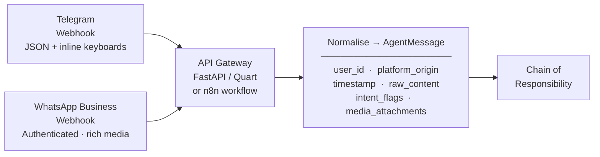

### Chain of Responsibility


---

## 2. Cognitive Memory Architecture

Four isolated memory tiers eliminate conversational amnesia. The 2026 LOCOMO benchmark confirms that optimised retrievers achieve sub-second latency versus >9 s for full-context approaches.

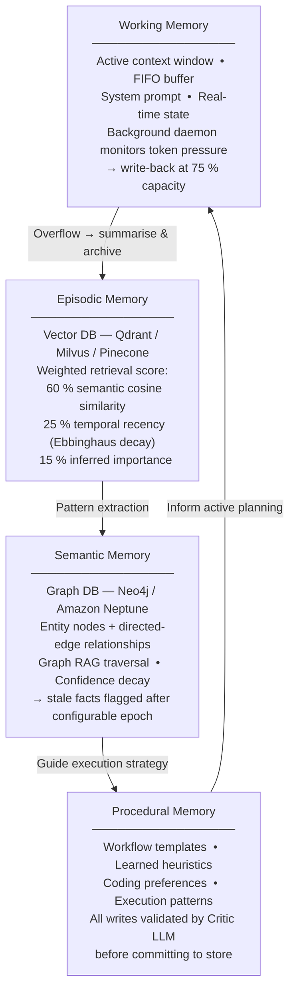

### Memory Consolidation Pipeline

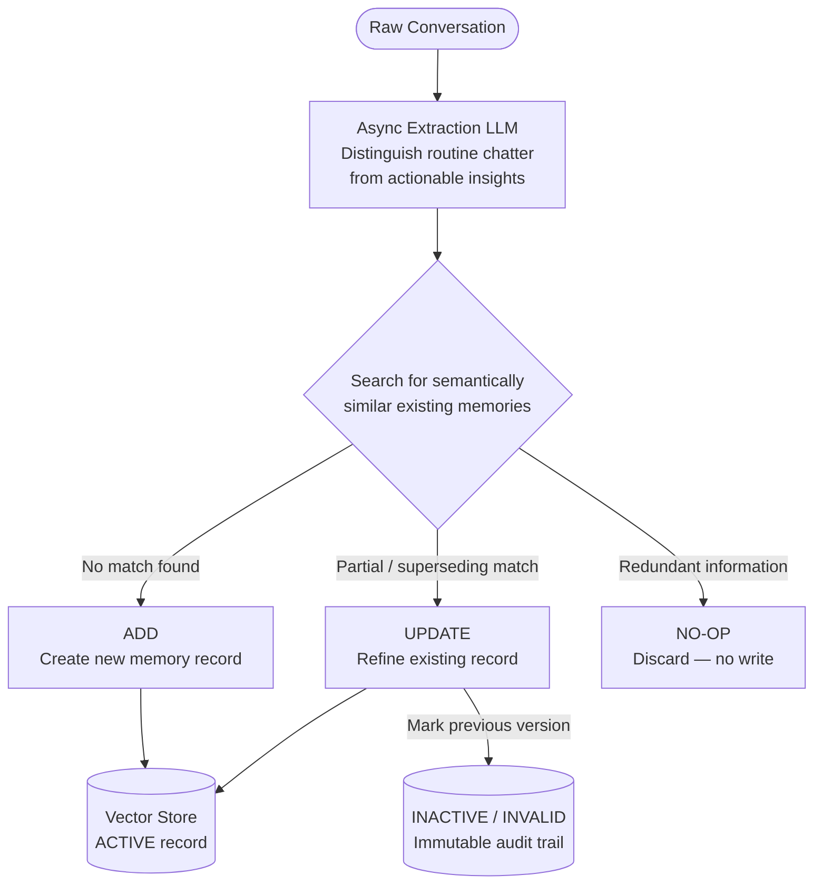

---

## 3. Cognitive Brain: Orchestration

### ReAct Execution Loop

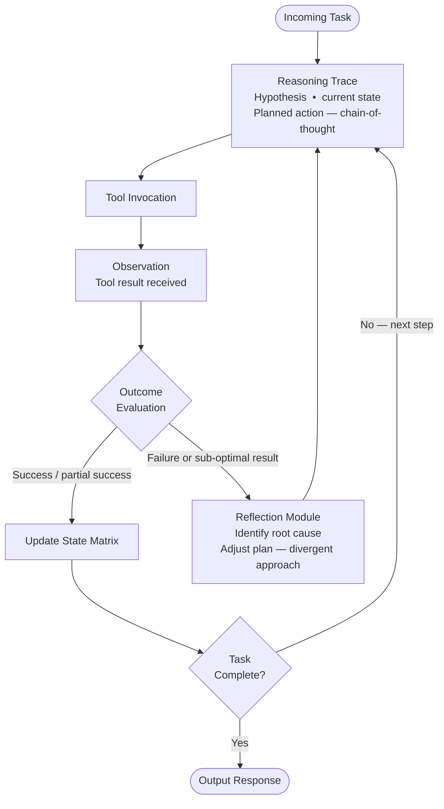

### Multi-Agent Swarm (Hierarchical Decomposition)


### Documentation-as-Cognitive-Model

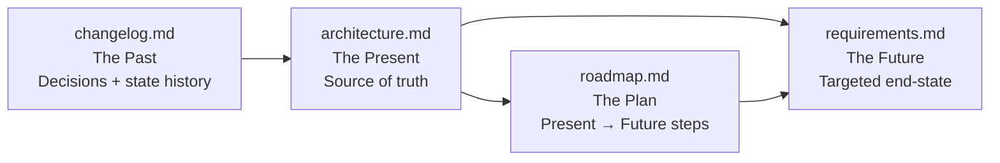

---

## 4. Intelligence Brain: Dynamic Model Routing

A lightweight DeBERTa-based complexity classifier intercepts every prompt and evaluates it across multiple dimensions before dispatching to the optimal model class.

### Classification Pipeline

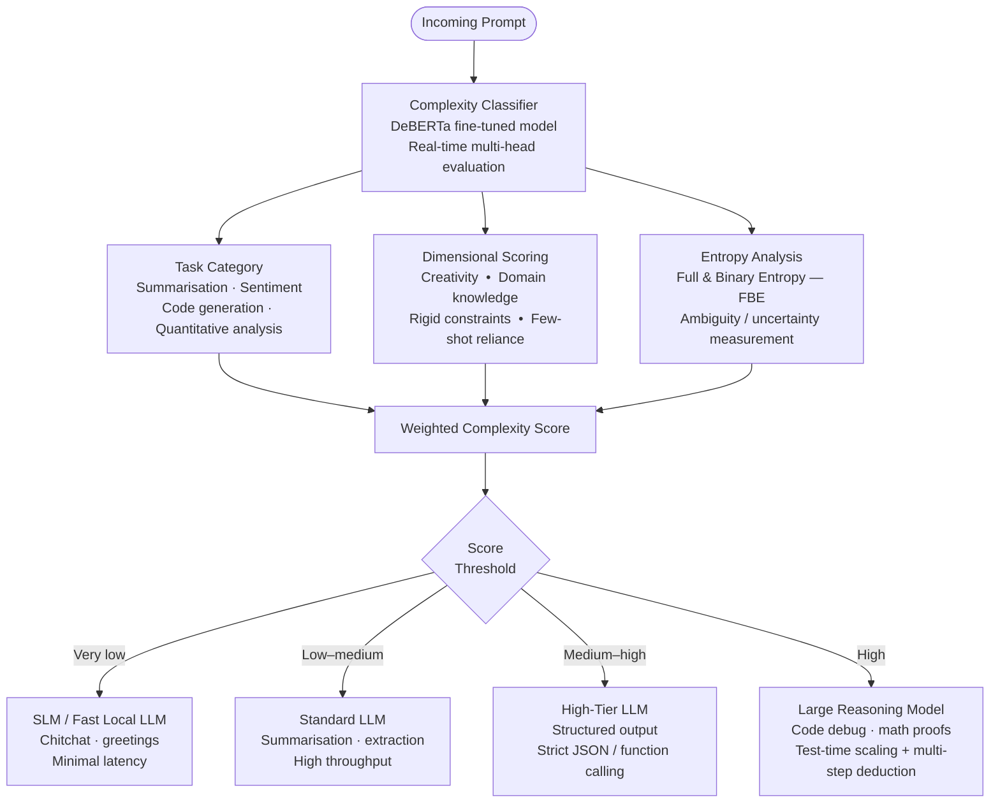

### Routing Reference Table

| Task Profile | Target Model Class | Rationale |
|---|---|---|
| Conversational Greeting / Chitchat | SLM / Fast Local LLM | Minimal latency; no deep reasoning needed |
| Contextual Summarisation / Extraction | Standard LLM | High throughput; context-window bound |
| Structured Output / Tool Parameter Generation | High-Tier LLM | Strict JSON schema + function calling required |
| Code Debugging / Abstract Logic / Math Proof | LRM (Reasoning Model) | Test-time scaling + multi-step deductive proof |

> **UniRoute integration:** Historical error vectors across representative prompts allow the router to generalise to entirely unseen foundation models, keeping routing logic adaptive as the open-source ecosystem evolves.

---

## 5. Computer-Use & Sandboxed Execution

### Execution Flow

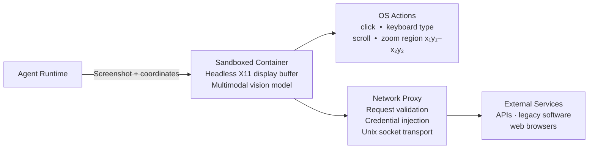

### Defence-in-Depth Security Layers

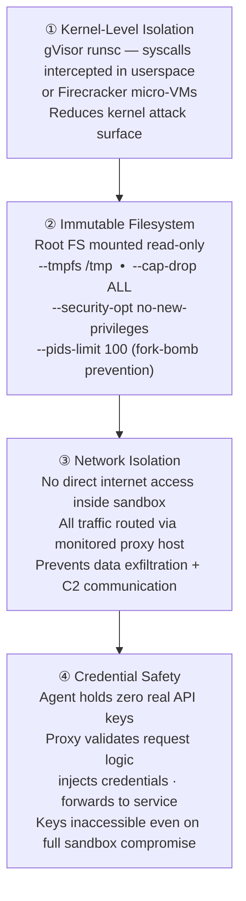

> **Isolation guarantee:** The sandbox container is strictly segregated from the Agent Runtime with no path to the surrounding infrastructure. Sensitive credentials and MPC key shards remain entirely outside the sandbox boundary at all times.

### Model Context Protocol (MCP)

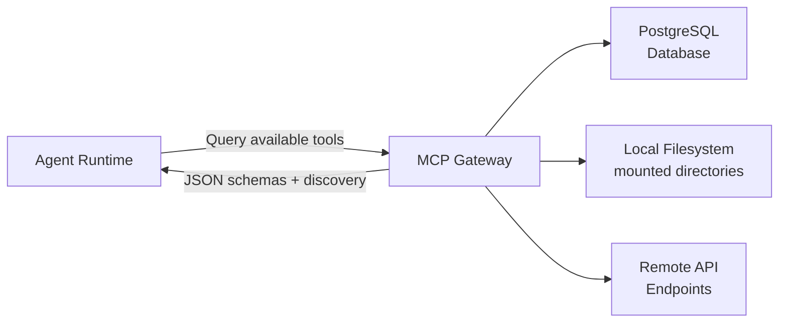

---

## 6. Secure Payment Module

### End-to-End Payment Flow


### MPC Wallet: Key Shard Architecture

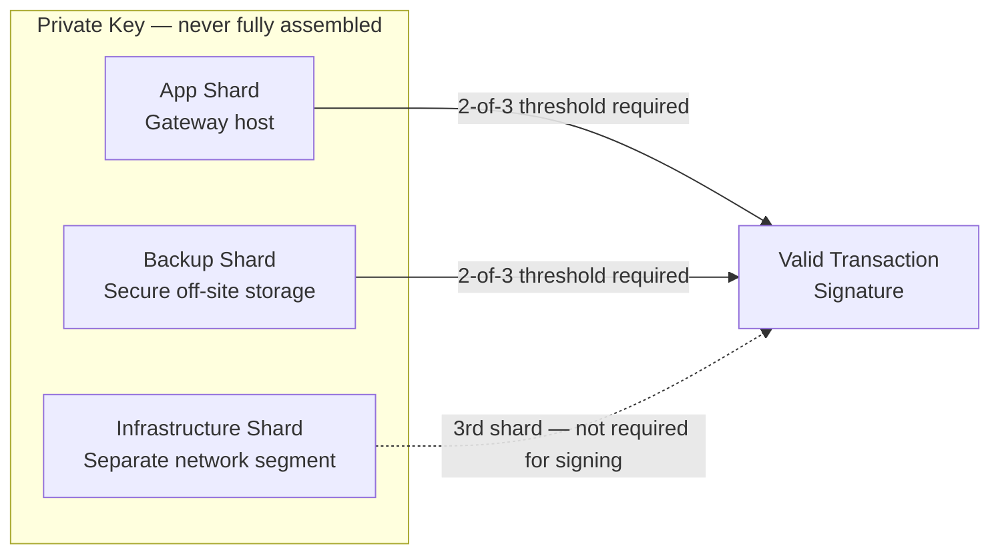

> **Idempotency:** All payment API calls use server-generated UUIDv4 idempotency keys tracked in an audit ledger. Razorpay webhook payloads are verified against `X-Razorpay-Signature` to prevent spoofed confirmations.

---

## 7. Codebase Structure

```
/agentic-ai/
├── agents/         # Base classes · worker implementations · typing interfaces
│                   # base_agent.py · planner_agent.py
│
├── memory/         # State-persistence subsystems
│                   # Vector DB wrappers (episodic) · Neo4j builders (semantic)
│                   # Procedural memory routing algorithms
│
├── brain/          # Central intelligence hub
│                   # ReAct loop (step_handler.py) · Task Manager
│                   # DeBERTa prompt complexity classifier
│
├── tools/          # MCP tool registries + standardised Python functions
│                   # calculator.py · file_manager.py
│
├── workflows/      # Multi-agent collaboration definitions
│                   # research_chain.py · multi_agent_workflow.yaml
│
├── api/            # Webhook normalisation layer
│                   # Chain of Responsibility handlers
│                   # Telegram + WhatsApp payload parsers
│
└── commerce/       # Agentic payment SDKs
                    # MPC wallet signers · Policy Engine guardrails
                    # Stripe + Razorpay adapters

compose.yaml        # Docker orchestration — services, networks, volumes
```

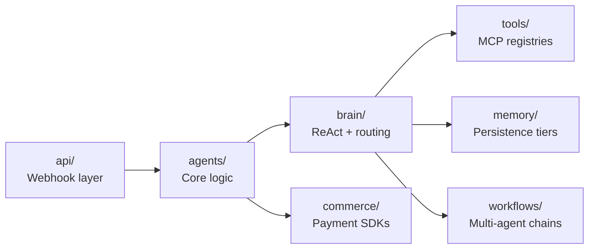

> Decoupling `api/` from `agents/` means the frontend (Telegram, WhatsApp, Slack) can be swapped without touching a single line of cognitive reasoning code.

---

## 8. Deployment Architecture

### Docker Compose Stack

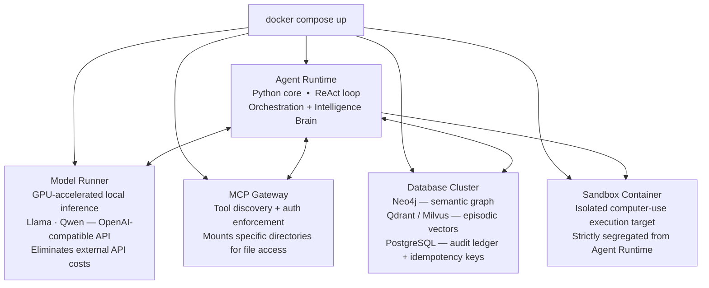

### Internal Networking & Ingress

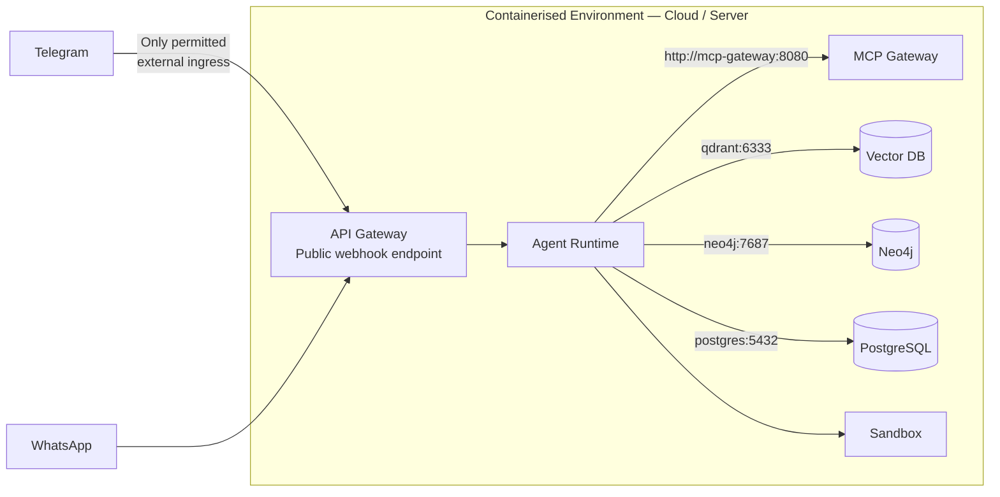

> The same `compose.yaml` deploys to **Google Cloud Run** (`gcloud run compose up`) or **Azure Container Apps** for serverless, horizontally scalable production without altering a single line of the codebase.

---

## References

1. [The AI Taxonomy: From Predicting Words to Mastering Logic](https://medium.com/@ajayverma23/the-ai-taxonomy-from-predicting-words-to-mastering-logic-edf3304b527f)
2. [The Three Memory Systems Every Production AI Agent Needs](https://tianpan.co/blog/long-term-memory-types-ai-agents)
3. [Choose a design pattern for your agentic AI system — Google Cloud](https://docs.cloud.google.com/architecture/choose-design-pattern-agentic-ai-system)
4. [A brain-inspired agentic architecture to improve planning with LLMs](https://pmc.ncbi.nlm.nih.gov/articles/PMC12485071/)
5. [Lessons from building an intelligent LLM router](https://www.reddit.com/r/LLMDevs/comments/1nsi2g7/lessons_from_building_an_intelligent_llm_router/)
6. [Agent Reasoning vs. LLM Reasoning: Cost Analysis](https://medium.com/@doubletaken/agent-reasoning-vs-llm-reasoning-key-differences-real-world-applications-and-cost-analysis-fdac6afe13cb)
7. [Building the Payment Gateway for AI Agents](https://dev.to/agentwallex/building-the-payment-gateway-for-ai-agents-a-technical-deep-dive-11g)
8. [Agentic Payments — Deep End-to-End Technical Guide](https://medium.com/@mamidipaka2003/agentic-payments-a-deep-end-to-end-technical-guide-llm-ai-upi-7ddc2535ca5b)
9. [Hosting the Agent SDK — Claude Docs](https://platform.claude.com/docs/en/agent-sdk/hosting)
10. [Agentic AI applications — Docker Docs](https://docs.docker.com/guides/agentic-ai/)
11. [Docker MCP Gateway: Secure Infrastructure for Agentic AI](https://www.docker.com/blog/docker-mcp-gateway-secure-infrastructure-for-agentic-ai/)
12. [Computer use tool — Claude API Docs](https://platform.claude.com/docs/en/agents-and-tools/tool-use/computer-use-tool)
13. [A Practical Guide for Production-Grade Agentic AI Workflows](https://arxiv.org/html/2512.08769v1)
14. [Modeling Agent Memory — Neo4j](https://neo4j.com/blog/developer/modeling-agent-memory/)
15. [CP-Router: Uncertainty-Aware Router Between LLM and LRM](https://arxiv.org/html/2505.19970v1)
16. [Stripe Machine Payments Protocol](https://stripe.com/blog/machine-payments-protocol)
17. [Razorpay Agentic Payments](https://razorpay.com/agentic-payments/)
18. [Cognitive Architectures for Language Agents — arXiv](https://arxiv.org/html/2309.02427v3)

# JARVIS — Agentic AI System

> *"Sometimes you gotta run before you can walk."* — Tony Stark

A hyper-capable, open-source agentic AI assistant built on DeepSeek R1 7B, fine-tuned with Unsloth, and deployed on HuggingFace. Designed to reason, remember, and act.

---

## Table of Contents

- [System Architecture](#system-architecture)
- [Core Components](#core-components)
- [Memory System](#memory-system)
- [LLM Router](#llm-router)
- [Skill Modules](#skill-modules)
- [Deployment](#deployment)
- [Setup](#setup)
- [Roadmap](#roadmap)

---

## System Architecture

```
USER INPUT (Telegram / Voice / CLI)
          │
          ▼
┌─────────────────────┐
│   INPUT PROCESSOR   │  ← Intent classification, context injection
└─────────────────────┘
          │
          ▼
┌─────────────────────┐
│   COGNITIVE BRAIN   │  ← ReAct loop: Reason → Act → Observe → Repeat
│   (LLM Router)      │
└─────────────────────┘
     │         │
     ▼         ▼
┌─────────┐ ┌──────────────┐
│ MEMORY  │ │  SKILL AGENT │  ← Tool execution
│ ENGINE  │ │  DISPATCHER  │
└─────────┘ └──────────────┘
     │              │
     ▼              ▼
┌─────────────────────┐
│   RESPONSE BUILDER  │  ← JARVIS personality layer
└─────────────────────┘
          │
          ▼
     USER OUTPUT
```

---

## Core Components

### 1. Intelligence Brain (LLM Router)

Routes every query to the most capable model for the task:

| Task Type | Model Used | Why |
|---|---|---|
| Complex reasoning | DeepSeek R1 7B (local) | Best open-source LRM |
| Quick responses | Qwen 2.5 3B (local) | Fast, lightweight |
| Code generation | DeepSeek Coder | Specialized |
| Fallback | HuggingFace API | When local fails |

### 2. Cognitive Brain (ReAct Loop)

```
OBSERVE → THINK → ACT → OBSERVE → THINK → ACT → ...
```

The ReAct (Reasoning + Acting) loop gives JARVIS the ability to:
- Break complex tasks into sub-tasks
- Use tools mid-reasoning
- Self-correct when a tool returns unexpected results
- Know when to stop and respond

### 3. Personality Layer

JARVIS responds with:
- British wit and dry humor
- Unwavering loyalty to the user
- Confidence without arrogance
- Addresses user as "Sir" by default

---

## Memory System

Four-tier memory architecture:

```
TIER 1: Working Memory (RAM)
└── Current conversation context (last 20 turns)

TIER 2: Episodic Memory (SQLite)
└── Past conversations, timestamped, searchable

TIER 3: Semantic Memory (ChromaDB)
└── Facts, knowledge, embeddings — vector search

TIER 4: Procedural Memory (JSON/Python)
└── Skills, tools, how-to knowledge
```

Every response is automatically stored and retrievable.

---

## LLM Router

```python
def route_query(query: str) -> str:
    if is_complex_reasoning(query):
        return call_deepseek_r1(query)
    elif is_code_task(query):
        return call_deepseek_coder(query)
    elif is_simple_qa(query):
        return call_qwen_fast(query)
    else:
        return call_huggingface_api(query)
```

---

## Skill Modules

| Skill | What it does | Status |
|---|---|---|
| Web search | Real-time internet search | ✅ v1 |
| File read/write | Read, edit, create files | ✅ v1 |
| Code execution | Run Python scripts | ✅ v1 |
| Screen vision | See your screen | 🔄 v2 |
| Voice pipeline | STT → LLM → TTS | 🔄 v2 |
| Browser control | Automate web tasks | 🔄 v2 |
| System control | Launch apps, control PC | 🔄 v3 |
| Payment (x402) | Crypto micro-payments | 🔄 v4 |

---

## Deployment

### Local (Ollama)
```bash
ollama pull deepseek-r1:7b
python jarvis.py --mode local
```

### HuggingFace Spaces
```bash
git push huggingface main
# Auto-deploys on push
```

### Telegram Bot
```bash
export TELEGRAM_TOKEN=your_token
python jarvis.py --mode telegram
```

---

## Setup

```bash
# Clone the repo
git clone https://github.com/suhas12345685-pro/Jarvis
cd Jarvis

# Install dependencies
npm install        # Node.js modules
pip install -r requirements.txt   # Python modules

# Configure
cp .env.example .env
# Add your API keys to .env

# Run
node index.js
```

### Requirements
- Node.js 18+
- Python 3.10+
- Ollama (for local LLM)
- 8GB+ RAM
- 10GB+ free disk space

---

## Fine-tuning (Unsloth + Colab)

1. Open `training/finetune.ipynb` in Google Colab
2. Select T4 GPU runtime (free)
3. Run all cells
4. Model auto-uploads to HuggingFace

Dataset format:
```json
{
  "instruction": "What is the weather like?",
  "input": "",
  "output": "Checking atmospheric conditions, Sir. Current temperature in Hyderabad is 38°C with clear skies. Might I suggest staying hydrated."
}
```

---

## Roadmap

### Phase 1 — Foundation (Now)
- [x] Node.js architecture
- [x] Telegram interface
- [x] Basic LLM routing
- [ ] Dataset creation (1,000 JARVIS conversations)
- [ ] Unsloth fine-tune on Colab
- [ ] HuggingFace deployment

### Phase 2 — Intelligence (Month 2)
- [ ] 4-tier memory system
- [ ] ReAct reasoning loop
- [ ] Web search skill
- [ ] Code execution skill

### Phase 3 — Awareness (Month 3)
- [ ] Screen vision (screenshot-desktop)
- [ ] Voice pipeline (STT→LLM→TTS)
- [ ] System state monitoring
- [ ] Location awareness

### Phase 4 — Autonomy (Month 4+)
- [ ] Long-horizon planning
- [ ] Browser automation
- [ ] Multi-agent orchestration
- [ ] Open-source release

---

## Tech Stack

| Layer | Technology |
|---|---|
| Runtime | Node.js 18 |
| LLM (local) | Ollama + DeepSeek R1 7B |
| Fine-tuning | Unsloth + Google Colab |
| Vector DB | ChromaDB |
| Relational DB | SQLite |
| Knowledge graph | NetworkX |
| Messaging | Telegram Bot API |
| Hosting | HuggingFace Spaces |
| Voice | VB-Cable + faster-whisper |

---

## License

MIT — free to use, modify, and distribute.

---

*Built by Suhas, age 14, Hyderabad, India.*  
*"With great power comes great responsibility."*


# JARVIS — Agentic AI System

> *"Sometimes you gotta run before you can walk."* — Tony Stark

A hyper-capable, open-source agentic AI assistant built on DeepSeek R1 7B, fine-tuned with Unsloth, and deployed on HuggingFace. Designed to reason, remember, and act.

---

## Table of Contents

- [System Architecture](#system-architecture)
- [Core Components](#core-components)
- [Memory System](#memory-system)
- [LLM Router](#llm-router)
- [Skill Modules](#skill-modules)
- [Deployment](#deployment)
- [Setup](#setup)
- [Roadmap](#roadmap)

---

## System Architecture

```
USER INPUT (Telegram / Voice / CLI)
          │
          ▼
┌─────────────────────┐
│   INPUT PROCESSOR   │  ← Intent classification, context injection
└─────────────────────┘
          │
          ▼
┌─────────────────────┐
│   COGNITIVE BRAIN   │  ← ReAct loop: Reason → Act → Observe → Repeat
│   (LLM Router)      │
└─────────────────────┘
     │         │
     ▼         ▼
┌─────────┐ ┌──────────────┐
│ MEMORY  │ │  SKILL AGENT │  ← Tool execution
│ ENGINE  │ │  DISPATCHER  │
└─────────┘ └──────────────┘
     │              │
     ▼              ▼
┌─────────────────────┐
│   RESPONSE BUILDER  │  ← JARVIS personality layer
└─────────────────────┘
          │
          ▼
     USER OUTPUT
```

---

## Core Components

### 1. Intelligence Brain (LLM Router)

Routes every query to the most capable model for the task:

| Task Type | Model Used | Why |
|---|---|---|
| Complex reasoning | DeepSeek R1 7B (local) | Best open-source LRM |
| Quick responses | Qwen 2.5 3B (local) | Fast, lightweight |
| Code generation | DeepSeek Coder | Specialized |
| Fallback | HuggingFace API | When local fails |

### 2. Cognitive Brain (ReAct Loop)

```
OBSERVE → THINK → ACT → OBSERVE → THINK → ACT → ...
```

The ReAct (Reasoning + Acting) loop gives JARVIS the ability to:
- Break complex tasks into sub-tasks
- Use tools mid-reasoning
- Self-correct when a tool returns unexpected results
- Know when to stop and respond

### 3. Personality Layer

JARVIS responds with:
- British wit and dry humor
- Unwavering loyalty to the user
- Confidence without arrogance
- Addresses user as "Sir" by default

---

## Memory System

Four-tier memory architecture:

```
TIER 1: Working Memory (RAM)
└── Current conversation context (last 20 turns)

TIER 2: Episodic Memory (SQLite)
└── Past conversations, timestamped, searchable

TIER 3: Semantic Memory (ChromaDB)
└── Facts, knowledge, embeddings — vector search

TIER 4: Procedural Memory (JSON/Python)
└── Skills, tools, how-to knowledge
```

Every response is automatically stored and retrievable.

---

## LLM Router

```python
def route_query(query: str) -> str:
    if is_complex_reasoning(query):
        return call_deepseek_r1(query)
    elif is_code_task(query):
        return call_deepseek_coder(query)
    elif is_simple_qa(query):
        return call_qwen_fast(query)
    else:
        return call_huggingface_api(query)
```

---

## Skill Modules

| Skill | What it does | Status |
|---|---|---|
| Web search | Real-time internet search | ✅ v1 |
| File read/write | Read, edit, create files | ✅ v1 |
| Code execution | Run Python scripts | ✅ v1 |
| Screen vision | See your screen | 🔄 v2 |
| Voice pipeline | STT → LLM → TTS | 🔄 v2 |
| Browser control | Automate web tasks | 🔄 v2 |
| System control | Launch apps, control PC | 🔄 v3 |
| Payment (x402) | Crypto micro-payments | 🔄 v4 |

---

## Deployment

### Local (Ollama)
```bash
ollama pull deepseek-r1:7b
python jarvis.py --mode local
```

### HuggingFace Spaces
```bash
git push huggingface main
# Auto-deploys on push
```

### Telegram Bot
```bash
export TELEGRAM_TOKEN=your_token
python jarvis.py --mode telegram
```

---

## Setup

```bash
# Clone the repo
git clone https://github.com/suhas12345685-pro/Jarvis
cd Jarvis

# Install dependencies
npm install        # Node.js modules
pip install -r requirements.txt   # Python modules

# Configure
cp .env.example .env
# Add your API keys to .env

# Run
node index.js
```

### Requirements
- Node.js 18+
- Python 3.10+
- Ollama (for local LLM)
- 8GB+ RAM
- 10GB+ free disk space

---

## Fine-tuning (Unsloth + Colab)

1. Open `training/finetune.ipynb` in Google Colab
2. Select T4 GPU runtime (free)
3. Run all cells
4. Model auto-uploads to HuggingFace

Dataset format:
```json
{
  "instruction": "What is the weather like?",
  "input": "",
  "output": "Checking atmospheric conditions, Sir. Current temperature in Hyderabad is 38°C with clear skies. Might I suggest staying hydrated."
}
```

---

## Roadmap

### Phase 1 — Foundation (Now)
- [x] Node.js architecture
- [x] Telegram interface
- [x] Basic LLM routing
- [ ] Dataset creation (1,000 JARVIS conversations)
- [ ] Unsloth fine-tune on Colab
- [ ] HuggingFace deployment

### Phase 2 — Intelligence (Month 2)
- [ ] 4-tier memory system
- [ ] ReAct reasoning loop
- [ ] Web search skill
- [ ] Code execution skill

### Phase 3 — Awareness (Month 3)
- [ ] Screen vision (screenshot-desktop)
- [ ] Voice pipeline (STT→LLM→TTS)
- [ ] System state monitoring
- [ ] Location awareness

### Phase 4 — Autonomy (Month 4+)
- [ ] Long-horizon planning
- [ ] Browser automation
- [ ] Multi-agent orchestration
- [ ] Open-source release

---

## Tech Stack

| Layer | Technology |
|---|---|
| Runtime | Node.js 18 |
| LLM (local) | Ollama + DeepSeek R1 7B |
| Fine-tuning | Unsloth + Google Colab |
| Vector DB | ChromaDB |
| Relational DB | SQLite |
| Knowledge graph | NetworkX |
| Messaging | Telegram Bot API |
| Hosting | HuggingFace Spaces |
| Voice | VB-Cable + faster-whisper |

---

## License

MIT — free to use, modify, and distribute.

---
 main
