# Self-Hosted Agentic AI Infrastructure

## System Architecture Overview

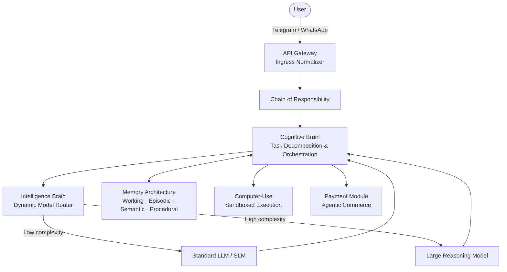

---

## 1. Headless UI: Messaging Integration

The system operates entirely headlessly. Telegram and WhatsApp Business webhooks are the sole user interface. A unified API Gateway (FastAPI / Quart) normalises all incoming payloads into a standard `AgentMessage` object before routing through the Chain of Responsibility.

### Ingress Normalisation

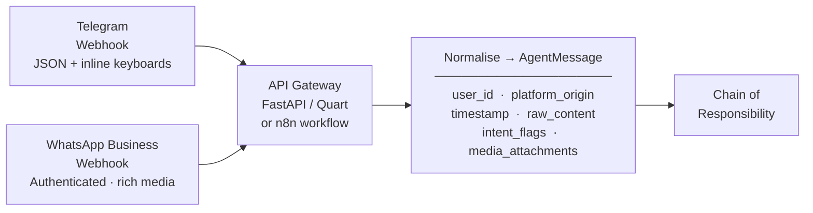

### Chain of Responsibility

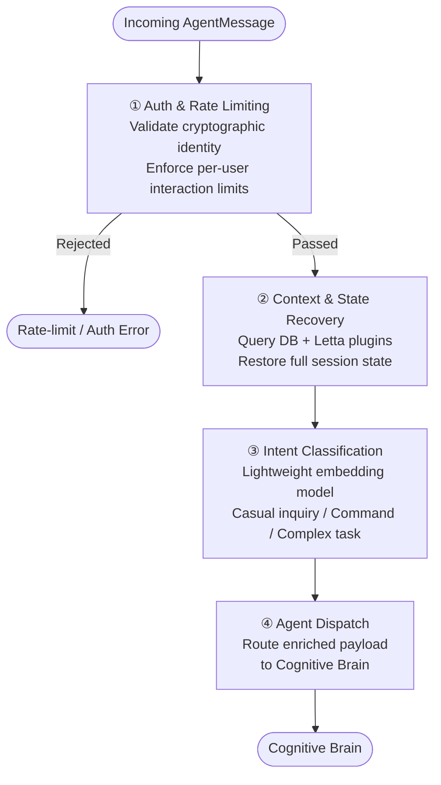

---

## 2. Cognitive Memory Architecture

Four isolated memory tiers eliminate conversational amnesia. The 2026 LOCOMO benchmark confirms that optimised retrievers achieve sub-second latency versus >9 s for full-context approaches.

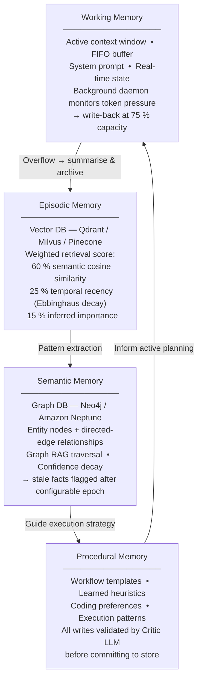

### Memory Consolidation Pipeline


---

## 3. Cognitive Brain: Orchestration

### ReAct Execution Loop


### Multi-Agent Swarm (Hierarchical Decomposition)

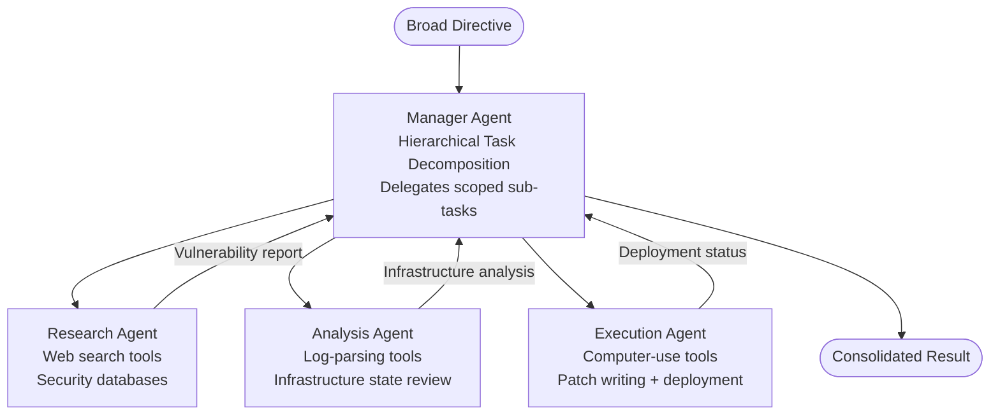

### Documentation-as-Cognitive-Model

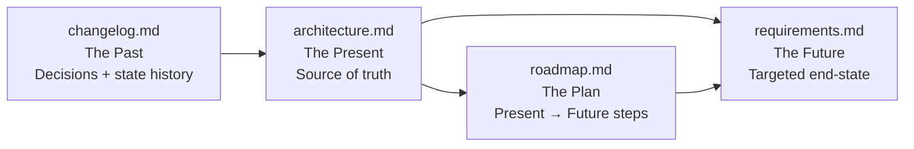

---

## 4. Intelligence Brain: Dynamic Model Routing

A lightweight DeBERTa-based complexity classifier intercepts every prompt and evaluates it across multiple dimensions before dispatching to the optimal model class.

### Classification Pipeline


### Routing Reference Table

| Task Profile | Target Model Class | Rationale |
|---|---|---|
| Conversational Greeting / Chitchat | SLM / Fast Local LLM | Minimal latency; no deep reasoning needed |
| Contextual Summarisation / Extraction | Standard LLM | High throughput; context-window bound |
| Structured Output / Tool Parameter Generation | High-Tier LLM | Strict JSON schema + function calling required |
| Code Debugging / Abstract Logic / Math Proof | LRM (Reasoning Model) | Test-time scaling + multi-step deductive proof |

> **UniRoute integration:** Historical error vectors across representative prompts allow the router to generalise to entirely unseen foundation models, keeping routing logic adaptive as the open-source ecosystem evolves.

---

## 5. Computer-Use & Sandboxed Execution

### Execution Flow

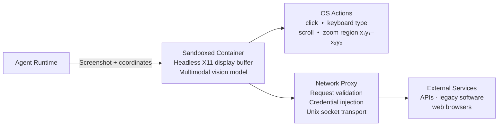

### Defence-in-Depth Security Layers

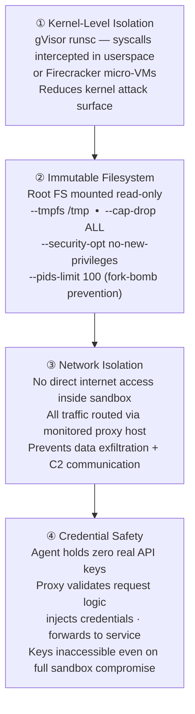

> **Isolation guarantee:** The sandbox container is strictly segregated from the Agent Runtime with no path to the surrounding infrastructure. Sensitive credentials and MPC key shards remain entirely outside the sandbox boundary at all times.

### Model Context Protocol (MCP)

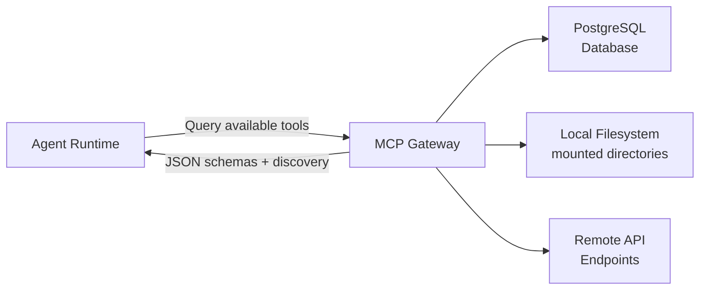

---

## 6. Secure Payment Module

### End-to-End Payment Flow

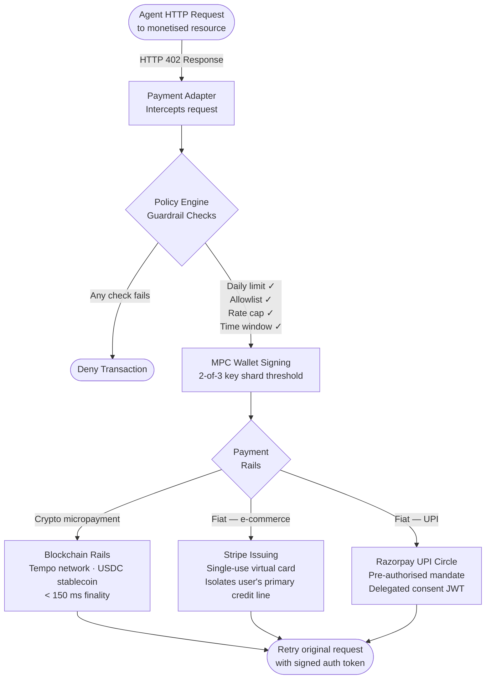

### MPC Wallet: Key Shard Architecture

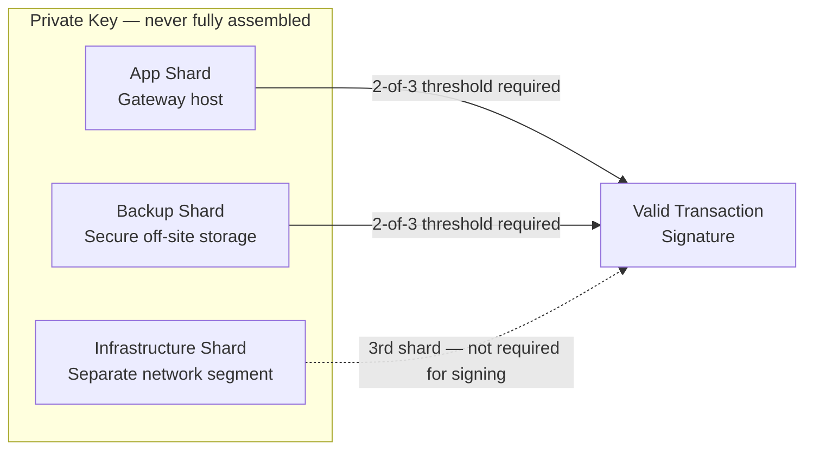

> **Idempotency:** All payment API calls use server-generated UUIDv4 idempotency keys tracked in an audit ledger. Razorpay webhook payloads are verified against `X-Razorpay-Signature` to prevent spoofed confirmations.

---

## 7. Codebase Structure

```
/agentic-ai/
├── agents/         # Base classes · worker implementations · typing interfaces
│                   # base_agent.py · planner_agent.py
│
├── memory/         # State-persistence subsystems
│                   # Vector DB wrappers (episodic) · Neo4j builders (semantic)
│                   # Procedural memory routing algorithms
│
├── brain/          # Central intelligence hub
│                   # ReAct loop (step_handler.py) · Task Manager
│                   # DeBERTa prompt complexity classifier
│
├── tools/          # MCP tool registries + standardised Python functions
│                   # calculator.py · file_manager.py
│
├── workflows/      # Multi-agent collaboration definitions
│                   # research_chain.py · multi_agent_workflow.yaml
│
├── api/            # Webhook normalisation layer
│                   # Chain of Responsibility handlers
│                   # Telegram + WhatsApp payload parsers
│
└── commerce/       # Agentic payment SDKs
                    # MPC wallet signers · Policy Engine guardrails
                    # Stripe + Razorpay adapters

compose.yaml        # Docker orchestration — services, networks, volumes
```

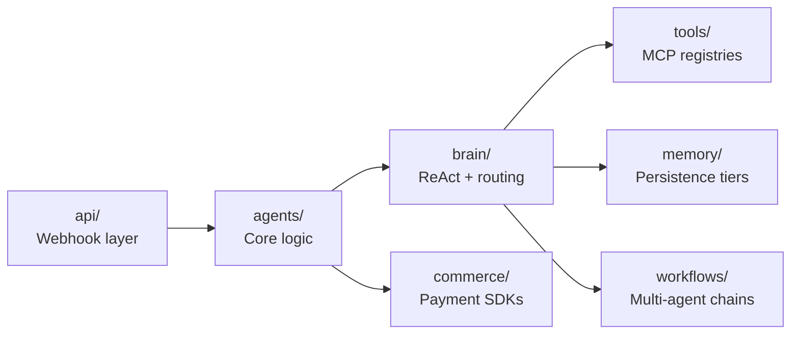

> Decoupling `api/` from `agents/` means the frontend (Telegram, WhatsApp, Slack) can be swapped without touching a single line of cognitive reasoning code.

---

## 8. Deployment Architecture

### Docker Compose Stack

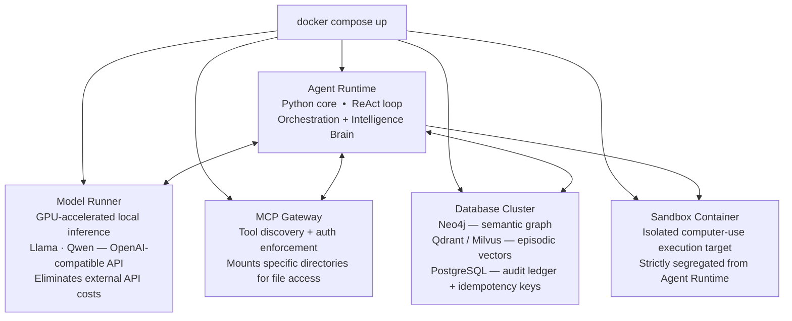

### Internal Networking & Ingress

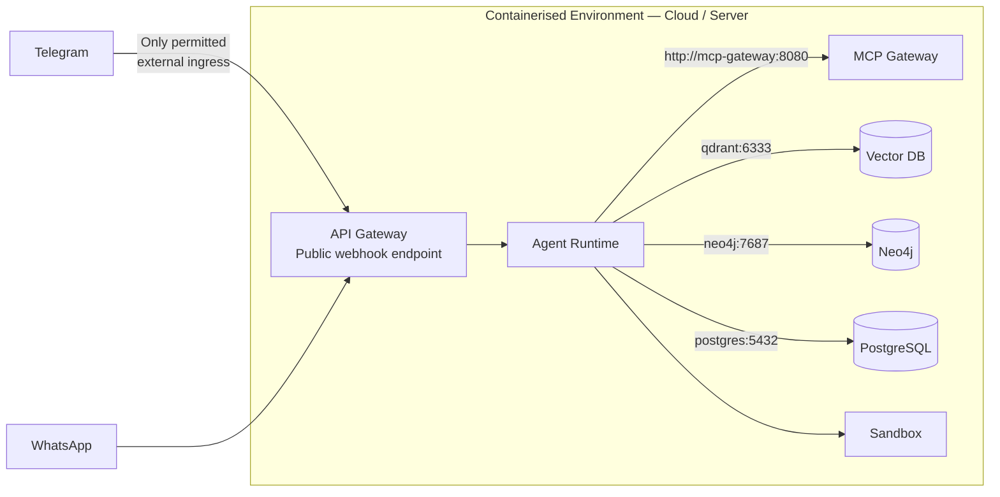

> The same `compose.yaml` deploys to **Google Cloud Run** (`gcloud run compose up`) or **Azure Container Apps** for serverless, horizontally scalable production without altering a single line of the codebase.

---

## References

1. [The AI Taxonomy: From Predicting Words to Mastering Logic](https://medium.com/@ajayverma23/the-ai-taxonomy-from-predicting-words-to-mastering-logic-edf3304b527f)
2. [The Three Memory Systems Every Production AI Agent Needs](https://tianpan.co/blog/long-term-memory-types-ai-agents)
3. [Choose a design pattern for your agentic AI system — Google Cloud](https://docs.cloud.google.com/architecture/choose-design-pattern-agentic-ai-system)
4. [A brain-inspired agentic architecture to improve planning with LLMs](https://pmc.ncbi.nlm.nih.gov/articles/PMC12485071/)
5. [Lessons from building an intelligent LLM router](https://www.reddit.com/r/LLMDevs/comments/1nsi2g7/lessons_from_building_an_intelligent_llm_router/)
6. [Agent Reasoning vs. LLM Reasoning: Cost Analysis](https://medium.com/@doubletaken/agent-reasoning-vs-llm-reasoning-key-differences-real-world-applications-and-cost-analysis-fdac6afe13cb)
7. [Building the Payment Gateway for AI Agents](https://dev.to/agentwallex/building-the-payment-gateway-for-ai-agents-a-technical-deep-dive-11g)
8. [Agentic Payments — Deep End-to-End Technical Guide](https://medium.com/@mamidipaka2003/agentic-payments-a-deep-end-to-end-technical-guide-llm-ai-upi-7ddc2535ca5b)
9. [Hosting the Agent SDK — Claude Docs](https://platform.claude.com/docs/en/agent-sdk/hosting)
10. [Agentic AI applications — Docker Docs](https://docs.docker.com/guides/agentic-ai/)
11. [Docker MCP Gateway: Secure Infrastructure for Agentic AI](https://www.docker.com/blog/docker-mcp-gateway-secure-infrastructure-for-agentic-ai/)
12. [Computer use tool — Claude API Docs](https://platform.claude.com/docs/en/agents-and-tools/tool-use/computer-use-tool)
13. [A Practical Guide for Production-Grade Agentic AI Workflows](https://arxiv.org/html/2512.08769v1)
14. [Modeling Agent Memory — Neo4j](https://neo4j.com/blog/developer/modeling-agent-memory/)
15. [CP-Router: Uncertainty-Aware Router Between LLM and LRM](https://arxiv.org/html/2505.19970v1)
16. [Stripe Machine Payments Protocol](https://stripe.com/blog/machine-payments-protocol)
17. [Razorpay Agentic Payments](https://razorpay.com/agentic-payments/)
18. [Cognitive Architectures for Language Agents — arXiv](https://arxiv.org/html/2309.02427v3)

---

# JARVIS — Just A Rather Very Intelligent System

> *"Sometimes you gotta run before you can walk."* — Tony Stark

[](LICENSE)
[](https://nodejs.org)
[](https://python.org)
[](https://claude.ai)

A hyper-capable, open-source agentic AI assistant. Built on DeepSeek R1 7B, fine-tuned with Unsloth, deployed on HuggingFace. Designed to reason, remember, act — and run 24/7 without you touching it.

**Built by Suhas, age 14, Hyderabad, India.**

---

## Table of Contents

- [Vision](#vision)
- [Architecture](#architecture)
- [Memory Architecture](#memory-architecture)
- [Build Roadmap](#build-roadmap)
- [Skill Modules](#skill-modules)
- [JARVIS Gateway UI](#jarvis-gateway-ui)
- [LLM Stack](#llm-stack)
- [Fine-tuning](#fine-tuning)
- [Self-Healing System](#self-healing-system)
- [Security](#security)
- [Tech Stack](#tech-stack)
- [Setup](#setup)
- [Deployment](#deployment)
- [Project Structure](#project-structure)
- [License](#license)

---

## Vision

JARVIS is not a chatbot. It is an autonomous agentic AI system that:

- **Reasons** before it speaks (DeepSeek R1 LRM via GRPO training)
- **Remembers** everything across sessions (4-tier memory system)
- **Acts** autonomously (ReAct loop, tool use, browser control)
- **Watches** your screen and hears your voice (multimodal awareness)
- **Runs 24/7** without human supervision (self-healing watchdog system)
- **Grows** over time (logs failures, improves from mistakes)

The interface is a web dashboard called **JARVIS Gateway** — launched by typing `jarvis gateway` from any terminal.

### What we can build (solo, $0)

| Feature | Status | How |
|---|---|---|
| JARVIS personality | Buildable | Fine-tune + system prompt |
| Chain-of-thought reasoning | Buildable | DeepSeek R1 + GRPO |
| Persistent memory (4 tiers) | Buildable | SQLite + ChromaDB |
| Uncertainty detection | Buildable | Confidence scoring |
| Tool use (search, code, files) | Buildable | Skill modules |
| Telegram interface | Buildable | node-telegram-bot-api |
| Screen vision | Buildable | LLaVA via Ollama |
| Voice pipeline | Buildable | Deepgram + ElevenLabs |
| Self-healing 24/7 | Buildable | Watchdog + cron |
| Gateway dashboard | Buildable | React + Express |
| Near-zero hallucinations | Partial | RAG + grounding |
| Long-horizon planning | Partial | LangGraph agents |

---

## Architecture

```
USER INPUT (Telegram / Voice / Gateway UI)
          |
          v
   Intent Classifier  -- Classify, inject context, route
          |
          v
      LLM Router  -- Which model?
        /     \
   DeepSeek    Qwen Fast
   R1 7B       3B Quick
        \     /
          v
   ReAct Reasoning Loop  (Observe -> Think -> Act -> Repeat)
          |
   ┌──────┴──────┐
   v             v
Memory Engine   Skill Executor
SQLite +        Search, Code,
ChromaDB        Files, Vision
   |             |
   └──────┬──────┘
          v
   JARVIS Response  (Personality layer applied)
```

---

## Memory Architecture

Four-tier memory system:

| Tier | Name | Storage | Purpose |
|---|---|---|---|
| **T1** | Working Memory | In-RAM | Last 20 turns, instant access |
| **T2** | Episodic Memory | SQLite | Timestamped past conversations |
| **T3** | Semantic Memory | ChromaDB | Embeddings, similarity search |
| **T4** | Procedural Memory | JSON | Skills, how-to knowledge |

Every response is automatically stored and retrievable.

---

## Build Roadmap

### Phase 1 — Foundation
- JARVIS dataset (1,000 examples)
- Unsloth fine-tune
- Telegram bot
- LLM router
- Working memory
- HuggingFace deploy

### Phase 2 — Intelligence
- 4-tier memory
- ReAct loop
- Web search skill
- Code execution
- RAG engine
- MCP servers

### Phase 3 — Awareness
- Screen vision (LLaVA)
- Voice pipeline
- System monitor
- Proactive crons
- Gateway UI launch
- Self-healing watchdog

### Phase 4 — Autonomy
- Long-horizon planner
- Browser automation
- Multi-agent system
- CI/CD self-healing
- Self-improvement loop
- Open-source release

---

## Skill Modules

Each skill lives in its own folder with a `SKILL.md` file. Claude Code auto-triggers the right skill based on the description field.

```
src/skills/
  llm-router/         SKILL.md   -- Routes queries to optimal model
  temporal-memory/    SKILL.md   -- 4-tier memory system
  mcp-server/         SKILL.md   -- Builds MCP tool servers
  rag-engine/         SKILL.md   -- Grounded answers from documents
  screen-vision/      SKILL.md   -- LLaVA screen capture + description
  self-healing/       SKILL.md   -- Watchdog + auto-restart
  proactive-cron/     SKILL.md   -- Scheduled autonomous tasks
  security-guard/     SKILL.md   -- Injection defense + sandboxing
  multi-agent/        SKILL.md   -- Parallel specialist sub-agents
  directive-system/   SKILL.md   -- CLAUDE.md + AGENTS.md setup
  cicd-headless/      SKILL.md   -- GitHub Actions auto-fix pipeline
  voice-pipeline/     SKILL.md   -- STT -> LLM -> TTS pipeline
  web-search/         SKILL.md   -- Brave Search API
  code-exec/          SKILL.md   -- Sandboxed code execution
  browser-auto/       SKILL.md   -- Playwright browser control
```

### Skill status

| Skill | Phase | Status |
|---|---|---|
| `llm-router` | P1 | Routes to DeepSeek R1 / Qwen / HuggingFace fallback |
| `temporal-memory` | P2 | SQLite (episodic) + ChromaDB (semantic) |
| `mcp-server` | P2 | FastMCP Python servers for Claude Code |
| `rag-engine` | P2 | Local embeddings via @xenova/transformers |
| `screen-vision` | P3 | LLaVA via Ollama, 1280x720 max, 5s rate limit |
| `self-healing` | P3 | 4-layer: preflight, OS restart, watchdog, guardian |
| `proactive-cron` | P3 | node-cron, anti-drift limit (3 msgs/hr) |
| `security-guard` | P3 | Prompt injection scanner + domain allowlist |
| `multi-agent` | P4 | Research, Code, File, Analysis specialists |
| `directive-system` | All | CLAUDE.md prevents Claude Code from repeating mistakes |
| `cicd-headless` | P4 | Auto-fix CI failures, push to PR branch |
| `voice-pipeline` | P3 | Deepgram STT -> JARVIS brain -> ElevenLabs TTS |

---

## JARVIS Gateway UI

A web dashboard launched from the terminal.

### Launch command

```bash
jarvis gateway
```

This opens `http://localhost:4747` in your browser automatically.

### Dashboard panels

| Panel | What it does |
|---|---|
| Chat | Real-time streaming chat with JARVIS via WebSocket |
| Skills | Register, enable/disable skill modules |
| Cron Jobs | Schedule autonomous tasks with cron expressions |
| Connections | Add API keys (Telegram, ElevenLabs, Brave, etc.) |
| Nodes | System health, latency monitoring, node status |

### Gateway architecture

```
Terminal: "jarvis gateway"
    -> bin/jarvis-gateway.js  (CLI launcher)
    -> backend/server.js       (Express + WebSocket on :4747)
        -> /api/chat        — POST message, stream response via WS
        -> /api/skills      — GET/POST/PATCH/DELETE
        -> /api/crons       — GET/POST/PATCH/DELETE
        -> /api/connections — GET/POST/DELETE (keys masked)
        -> /api/nodes       — GET (real system stats)
    -> frontend/public/        (Static dashboard)
    -> SQLite database         (Persists data across restarts)
```

### Install Gateway globally

```bash
cd gateway
npm install
npm run install:global
```

After this, `jarvis gateway` works from any folder.

---

## LLM Stack

| Model | Size | Use case | How to get |
|---|---|---|---|
| DeepSeek R1 | 7B | Complex reasoning (default) | `ollama pull deepseek-r1:7b` |
| Qwen 2.5 | 3B | Fast responses | `ollama pull qwen2.5:3b` |
| LLaVA | 7B | Screen vision | `ollama pull llava` |
| DeepSeek Coder | 7B | Code generation | `ollama pull deepseek-coder:7b` |
| HuggingFace API | - | Fallback when Ollama offline | Free tier |

### LLM Router logic

```
query -> classifier (heuristic, zero extra API calls)
      |
      v
reasoning  -> DeepSeek R1 7B   (default)
code       -> DeepSeek Coder   (contains: code, function, debug)
quick      -> Qwen 2.5 3B      (< 15 words, simple Q&A)
vision     -> LLaVA            (screen/image requests)
search     -> web_search + LLM (contains: latest, news, today)
fallback   -> HuggingFace API  (Ollama offline)
```

---

## Fine-tuning

JARVIS is fine-tuned on DeepSeek R1 7B using Unsloth on Google Colab (free T4 GPU).

### Steps

1. Run `node training/dataset/generate.js` to generate 1,000 JARVIS training examples
2. Open `training/finetune.ipynb` in Google Colab
3. Select T4 GPU runtime (free)
4. Run all cells — model auto-uploads to HuggingFace

### Dataset format (Alpaca)

```json
{
  "instruction": "What is the current weather in Hyderabad?",
  "input": "",
  "output": "Checking atmospheric conditions, Sir. Current temperature in Hyderabad is 38°C with clear skies. I would strongly recommend staying hydrated and avoiding direct sun exposure between noon and 4 PM."
}
```

### Training method: GRPO (same as DeepSeek R1)

GRPO (Group Relative Policy Optimization) trains the model to reason before answering. This is what makes DeepSeek R1 an LRM (Large Reasoning Model) instead of just an LLM.

---

## Self-Healing System

JARVIS runs 24/7 via a 4-layer reliability stack:

| Layer | Name | Purpose |
|---|---|---|
| 0 | Preflight | Validates all env vars before start (`scripts/preflight.sh`) |
| 1 | OS-Level | Windows Task Scheduler / systemd restarts on crash |
| 2 | Watchdog | Cron checks log freshness every 3 min, kills stalled process |
| 3 | Guardian | Detects expired tokens, revoked permissions, alerts user |

Watchdog cron (add to system cron or Task Scheduler):
```
*/3 * * * *   /path/to/jarvis/scripts/watchdog.sh
```

---

## Security

JARVIS implements defense-in-depth against prompt injection and unauthorized access.

### Prompt injection defense

Every piece of external content (websites, emails, PDFs) is scanned before being injected into the LLM context. Patterns like "ignore previous instructions" or "[SYSTEM] override" are detected and blocked. See `src/security/injection.js`.

### Domain allowlist

JARVIS can only fetch from pre-approved domains defined in `.env`:
```
ALLOWED_DOMAINS=google.com,wikipedia.org,github.com,arxiv.org
```

### Plan mode

Before executing any destructive action, JARVIS sends a plan to the user via Telegram for approval:
```
JARVIS Plan Review:
  • deleteFile(/docs/old_report.md)
  • sendEmail(to: boss@company.com)

Approve? /yes or /no
```

### Sandbox

All code execution is isolated to `./tmp/sandbox/`. File writes are restricted to paths defined in `.env`.

---

## Tech Stack

| Layer | Technology |
|---|---|
| Runtime | Node.js 18 |
| LLM local | Ollama + DeepSeek R1 7B |
| LLM training | Unsloth + Google Colab (free T4) |
| Vector DB | ChromaDB + @xenova/transformers (local embeddings) |
| Relational DB | SQLite (better-sqlite3) |
| Knowledge graph | NetworkX (Python) |
| MCP servers | FastMCP (Python) |
| Telegram | node-telegram-bot-api |
| Gateway frontend | HTML + CSS + Vanilla JS (zero build) |
| Gateway backend | Express.js + WebSocket |
| Voice STT | Deepgram |
| Voice TTS | ElevenLabs |
| Screen vision | screenshot-desktop + LLaVA |
| Browser automation | Playwright |
| CI/CD | GitHub Actions + claude -p headless |
| Hosting | HuggingFace Spaces (free) |
| Scheduling | node-cron + system cron/Task Scheduler |

---

## Setup

### Prerequisites

- Node.js 18+
- Python 3.10+
- Ollama installed (`ollama.ai`)
- 8GB+ RAM
- 10GB+ free disk space

### Install

```bash
# Clone the repo
git clone https://github.com/suhas12345685-pro/Agentic-AI
cd Agentic-AI

# Install Node dependencies
npm install

# Install Python dependencies
pip install -r requirements.txt

# Pull base LLMs
ollama pull deepseek-r1:7b
ollama pull qwen2.5:3b

# Configure environment
cp .env.example .env
# Edit .env — add your Telegram bot token and other API keys

# Run preflight check
bash scripts/preflight.sh

# Start JARVIS core
node index.js

# OR launch the Gateway dashboard
cd gateway
npm install
npm run install:global
jarvis-gateway
```

### Environment variables

See `.env.example` for the complete list.

---

## Deployment

### Local (Ollama)

```bash
ollama pull deepseek-r1:7b
node index.js
```

### HuggingFace Spaces (public demo)

```bash
cd deploy/hf_space
huggingface-cli upload <your-username>/jarvis-space .
```

### Telegram Bot

```bash
export TELEGRAM_BOT_TOKEN=your_token
node index.js --mode telegram
```

### Gateway dashboard

```bash
jarvis-gateway        # opens http://localhost:4747
```

---

## Project Structure

```
/Agentic-AI
  /src
    /brain              -- LLM routing, ReAct loop, planner, orchestrator
    /memory             -- Working, episodic, semantic, procedural memory
    /skills             -- Tool modules (each with SKILL.md)
    /personality        -- JARVIS character wrapper
    /interfaces         -- Telegram, CLI, voice
    /security           -- Injection defense, sandboxing, plan mode
    /utils              -- Logger, config
  /gateway
    /frontend           -- HTML/CSS/JS dashboard
    /backend            -- Express + WebSocket + SQLite
    /bin                -- jarvis-gateway CLI launcher
  /training
    /dataset            -- 1,000 JARVIS training examples
    finetune.ipynb      -- Unsloth Colab notebook
  /scripts
    preflight.sh        -- Layer 0 self-healing
    watchdog.sh         -- Layer 2 self-healing
  /deploy
    /hf_space           -- HuggingFace Spaces app
  /data                 -- SQLite DB + ChromaDB (gitignored)
  CLAUDE.md             -- Claude Code project memory
  AGENTS.md             -- Sub-agent role definitions
  TASK.md               -- Claude Code build phases
  .env.example
  index.js
  package.json
  requirements.txt
  README.md
```

---

## License

MIT — free to use, modify, and distribute.

---

*Built by Suhas, age 14, Hyderabad, India.*

*"The quiet mind of a vast machine."*
